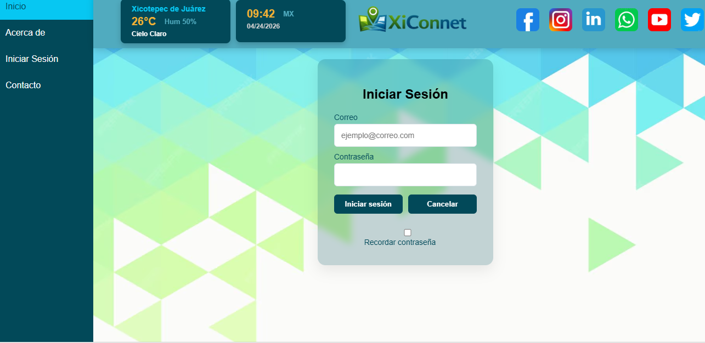
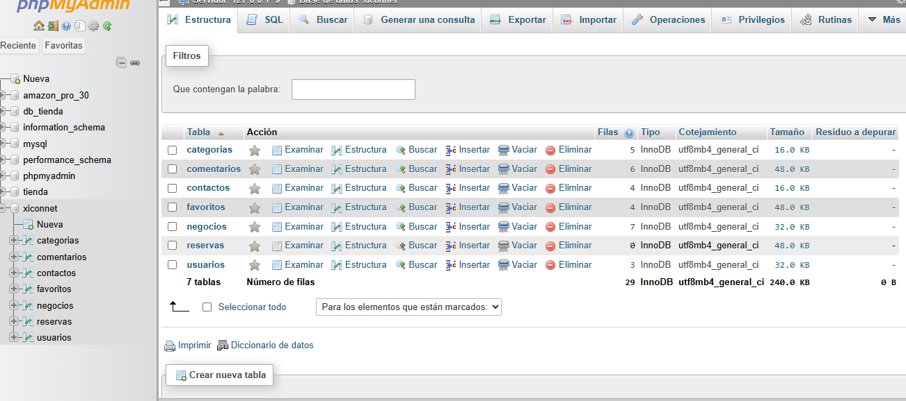
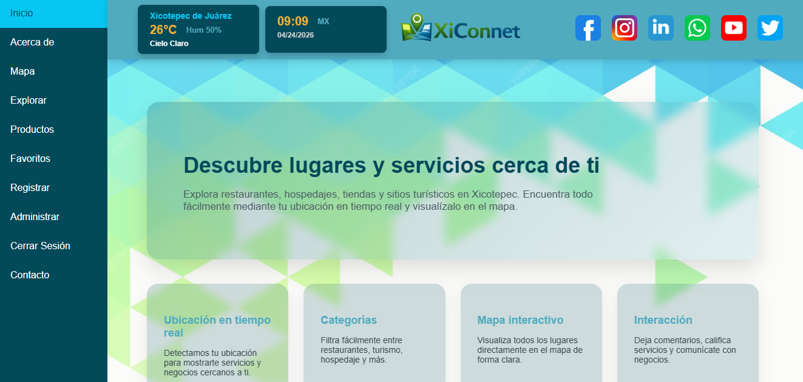

# XiConnet – Plataforma de Servicios Locales

# Autor
Hector Morales Soto
Proyecto académico 

---

XiConnet es una aplicación web diseñada para conectar usuarios con negocios locales, permitiendo explorar lugares, guardar favoritos, dejar comentarios y administrar información desde un panel administrativo.
Integra múltiples tecnologías modernas para la gestión y exploración combinando backend estructurado, frontend dinámico y consumo de APIs externas en una sola plataforma

---
## Ligin



# Tecnologías utilizadas

## Backend

* Node.js
* Express
* Sequelize
* MySQL
* API REST

## Frontend

* React (Vite)
* Axios
* CSS personalizado

---

# Arquitectura del proyecto

## Backend

Puerto: 8000
Base URL:

```bash
http://localhost:8000/api
```

---
## Base de datos


# Módulos implementados

* usuarios
* categorias
* negocios
* reservas
* favoritos
* contactos
* comentarios

Todos con operaciones CRUD.

---
## Inicio


# Autenticación

Endpoint:

```bash
POST /api/auth/login
```

Body:

```json
{
  "email": "usuario@email.com",
  "password": "123456"
}
```

Respuesta:

```json
{
  "id_usuario": 1,
  "nombre": "Hector",
  "email": "...",
  "rol": "admin"
}
```

Nota: Actualmente sin encriptación (pendiente implementación de JWT y bcrypt).

---

# Relaciones de base de datos

* Un negocio pertenece a una categoría
* Una reserva pertenece a usuario y negocio
* Un favorito pertenece a usuario y negocio
* Un comentario pertenece a usuario y negocio

---

# Funcionalidades principales

## Exploración de negocios

* Búsqueda por nombre y categoría
* Visualización en tarjetas
* Integración con mapa

## Favoritos

* Guardar negocios
* Eliminar favoritos
* Filtrado por usuario

## Comentarios y calificaciones

* Sistema de estrellas
* Comentarios por negocio
* Promedio dinámico

## Panel de administración

* Gestión de usuarios
* Visualización de negocios
* Eliminación de registros

## Catálogo externo

* Consumo de API externa de productos

## Hora en tiempo real

* Integración con API de zona horaria

## Clima

* Integración con API de clima

---

# APIs utilizadas

La aplicación integra un total de 5 APIs:

1. API interna (backend propio)

```env
VITE_APIBACK_URL=http://localhost:8000/api
```

2. Google Maps API (mapas)

```env
REACT_APP_GOOGLE_MAPS_API_KEY=
```

3. OpenWeather API (clima)

```env
VITE_OPENWEATHER_API_KEY=
```

4. FakeStore API (catálogo externo)

```env
VITE_API_URL=https://fakestoreapi.com/
```

5. Time API (zona horaria)

```env
VITE_TIME_API_BASE=https://timeapi.io/api
VITE_TIME_ZONE=America/Mexico_City
```

---

# Instalación

## Clonar repositorio

```bash
git clone <tu-repositorio>
```

## Backend

```bash
cd backend
npm install
npm start
```

## Frontend

```bash
cd frontend
npm install
npm run dev
```

---

# Estado del proyecto

* Backend funcional
* CRUD completo implementado
* Frontend conectado al backend
* Sistema de favoritos funcionando
* Comentarios con estrellas implementados
* Integración con múltiples APIs externas

---

# Mejoras futuras

* Implementar autenticación con JWT
* Encriptación de contraseñas con bcrypt
* Protección de rutas
* Geolocalización automática
* Estado de negocios (abierto/cerrado)
* Dashboard administrativo

---


